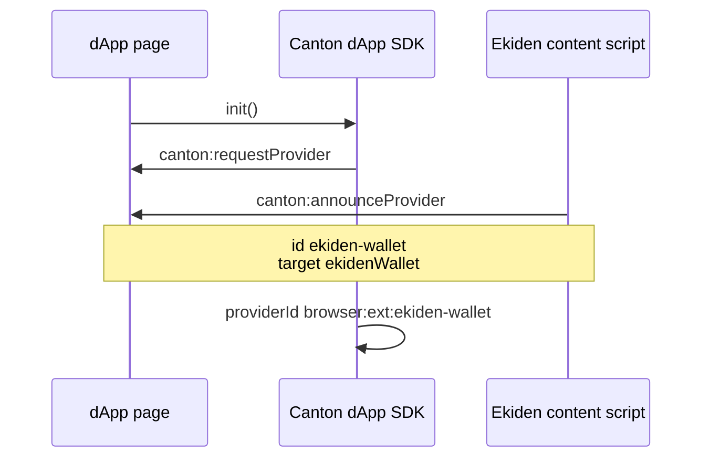
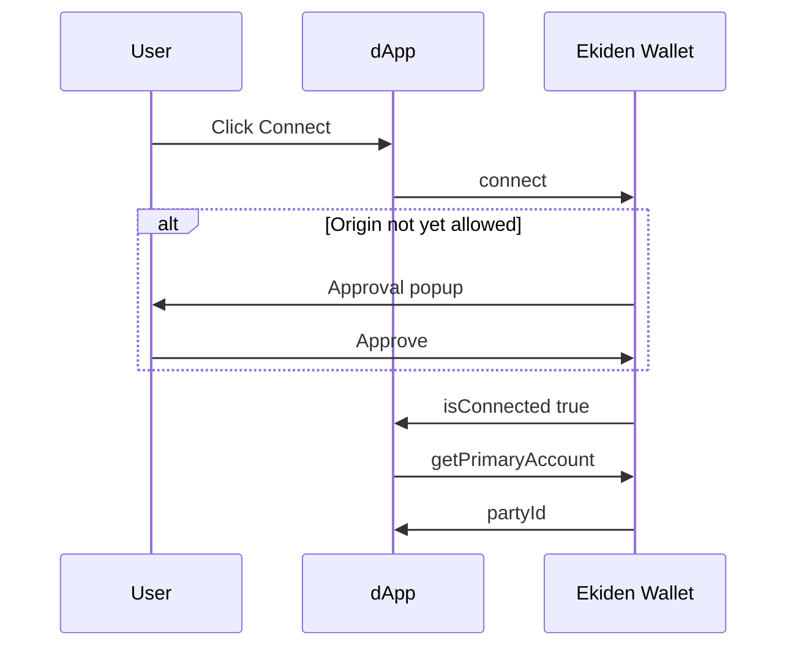
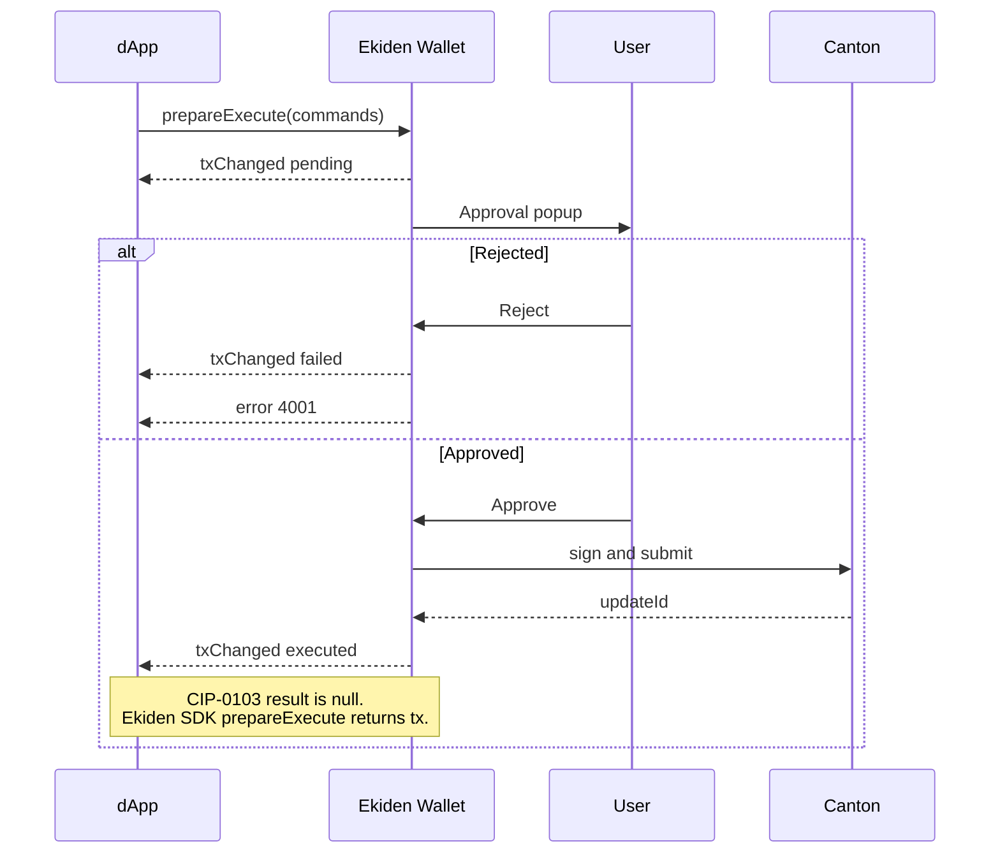

CIP-0103 is the Canton standard a website uses to talk to a wallet. The machine-readable spec is the sync OpenRPC document in the Splice wallet kernel. This page is the Ekiden reading of that spec: what we implement, and the one method we refuse.

Specification: [CIP-0103](https://github.com/canton-foundation/cips/blob/main/cip-0103/cip-0103.md).

Browser discovery: [Canton docs — browser extension](https://docs.canton.network/sdks-tools/sdks/dapp-sdk/wallet-providers/browser-extension).

For visual explanations of wallet interactions, see:

- [Discovery flow](#discovery-flow) — how a dApp discovers Ekiden Wallet.
- [Connection flow](#connection-flow) — how a user authorizes a wallet connection.
- [Transaction submission flow](#transaction-submission-flow) — how the wallet signs and submits transactions.

## Discovery

The Canton SDK does not look for `window.ekidenWallet` or `window.canton`. It dispatches `canton:requestProvider` and collects `canton:announceProvider` for a few hundred milliseconds.

Ekiden announces:

| Field | Value |
| --- | --- |
| `id` | `ekiden-wallet` |
| `name` | `Ekiden Wallet` |
| `target` | `ekidenWallet` |

The SDK’s provider id is `browser:ext:ekiden-wallet`.

A dApp that does not want auto-discovery can register the extension itself:

```ts
import { ExtensionAdapter } from "@canton-network/dapp-sdk";

await sdk.init({
  additionalAdapters: [
    new ExtensionAdapter({
      providerId: "browser:ext:ekiden-wallet",
      name: "Ekiden Wallet",
      target: "ekidenWallet",
    }),
  ],
});
```

`window.ekidenWallet` on the page is only a marker (`isEkiden`, `id`, `name`, `version`). Call the SDK, not that object.

### Discovery flow



## Wire protocol

Requests and responses are `window.postMessage` frames.

Request:

```json
{
  "type": "SPLICE_WALLET_REQUEST",
  "target": "ekidenWallet",
  "request": {
    "jsonrpc": "2.0",
    "id": "1",
    "method": "getPrimaryAccount",
    "params": {}
  }
}
```

Success:

```json
{
  "type": "SPLICE_WALLET_RESPONSE",
  "target": "ekidenWallet",
  "response": {
    "jsonrpc": "2.0",
    "id": "1",
    "result": {}
  }
}
```

Failure uses `response.error` with `{ code, message, data? }`.

Events are the same request frame **without** `id`:

```json
{
  "type": "SPLICE_WALLET_REQUEST",
  "target": "ekidenWallet",
  "request": {
    "jsonrpc": "2.0",
    "method": "txChanged",
    "params": { "status": "executed", "commandId": "cmd-1", "payload": {} }
  }
}
```

Frames whose `target` is set and is not `ekidenWallet` are ignored.

## Methods

| CIP-0103 | Ekiden behavior |
| --- | --- |
| `connect` | Popup unless this origin is already connected. Requires an initialized, unlocked wallet and an account on the active network. Returns `{ isConnected: true, isNetworkConnected: true }` |
| `disconnect` | Drops this origin. Emits `statusChanged` |
| `isConnected` | Same fields as connect. Does not open a popup |
| `status` | `connection`, `provider` (`id`, `version: "1.0.0"`, `providerType: "browser"`), `network.networkId`, `network.ledgerApi` (gateway URL). No `session.accessToken` |
| `getActiveNetwork` | Network the user selected in the wallet. The dApp cannot change it |
| `listAccounts` | Parties on that network. Each has `partyId`, `hint`, `publicKey`, `namespace`, `networkId`, `primary`, `signingProviderId`, `status` |
| `getPrimaryAccount` | The party selected in the wallet |
| `signMessage` | Popup, then a base64 Ed25519 signature of the primary party. Params: a string, `{ message: string }`, or `{ message: { hex \| base64 } }` |
| `prepareExecute` | Popup, sign, submit. JSON-RPC **result is `null`**, as the spec requires. Progress is `txChanged`. The Ekiden SDK method of the same name still returns `{ tx }` for older callers |
| `ledgerApi` | **Not implemented.** Error `4200`. See [Gaps](#gaps) |

`prepareExecute` params are a JSON Ledger API prepare body: `commands` (required), plus optional `commandId`, `actAs`, `synchronizerId`, `disclosedContracts`. A nested `params.params` object is flattened.

### Connection flow



### Transaction submission flow



## Events

| Event | When | Payload |
| --- | --- | --- |
| `accountsChanged` | Active party or network changes | Array of account objects |
| `statusChanged` | Connect, disconnect, or the same account change | Status object (`connection`, `provider`, `network`) |
| `txChanged` | `prepareExecute` lifecycle | `{ status, commandId, payload? }` |

`txChanged.status` is `pending` (approval opened), `executed` (`payload.updateId`, `payload.completionOffset`), or `failed` (user rejected, or submit failed). Ekiden does not emit a separate `signed` event; signing and submit are one approval.

## Errors

CIP-0103 uses the EIP-1193 / EIP-1474 codes. On the `SPLICE_WALLET_*` path Ekiden returns:

| Code | When |
| --- | --- |
| `4001` | User rejected the popup |
| `4100` | Origin is not connected, or the wallet is locked |
| `4200` | Unknown method, or `ledgerApi` |
| `-32602` | Invalid params (for example no `commands`) |
| `-32603` | Anything else |

The named Ekiden SDK methods (`ekidenWallet.connect`, …) still reject with `Error.message` and no code. `ekidenWallet.request` uses the codes above.

## Gaps

### `ledgerApi`

CIP-0103 says a wallet should proxy the participant JSON Ledger API, authenticated as the connected party, and return the JSON body unchanged.

Ekiden does not do that. The extension does not hold a participant token it can safely hand to a website, and it does not forward arbitrary HTTP to a validator. An open proxy would let any connected origin read or write anything that token allows.

Use these instead:

| Need | Call |
| --- | --- |
| Holdings | `getBalance` / `getCoinsBalance` on `@ekidenfi/dapp-sdk` |
| Active contracts | `getContracts` |
| Submit | `prepareExecute` |

`request("ledgerApi", …)` fails with `4200` and `data.reason` explaining the same limit.

### Async API

The remote CIP-0103 variant (`userUrl`, `connected` event) is for server-side wallets. Ekiden is in-page and synchronous. There is no `userUrl`.

### `signed` transaction event

The spec allows `txChanged` with `status: "signed"` before submit. Ekiden signs inside `prepareExecute` and only emits `pending`, then `executed` or `failed`.

## Ekiden SDK and CIP-0103 together

`@ekidenfi/dapp-sdk` is a thin client.

- Named methods use Ekiden’s own `postMessage` types (`CONNECT`, `GET_ACTIVE_ACCOUNT`, `EXECUTE`, …). `prepareExecute` resolves `{ tx: { status, commandId, payload } }`.
- `ekidenWallet.request(method, params)` and `ekidenWallet.on(event, listener)` use the CIP-0103 frames above. `request("prepareExecute", body)` resolves `null`.

Prefer the named methods in an Ekiden-only app. Prefer `sdk.connect()` from `@canton-network/dapp-sdk` when the app should list every CIP-0103 wallet.
