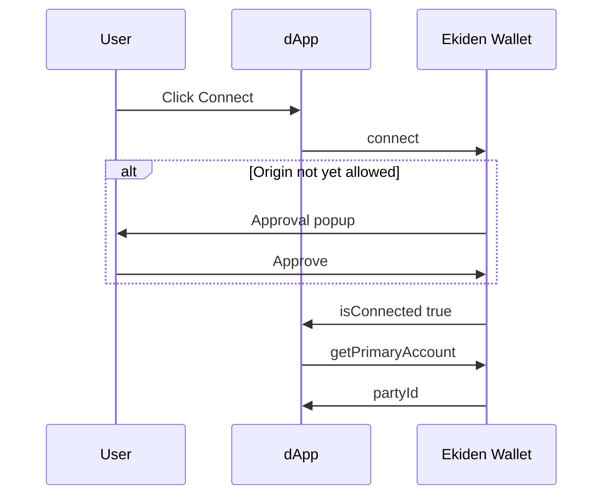

```mermaid
sequenceDiagram
  participant User
  participant App as dApp
  participant Ext as Ekiden Wallet

  User->>App: Click Connect
  App->>Ext: connect
  alt Origin not yet allowed
    Ext->>User: Approval popup
    User->>Ext: Approve
  end
  Ext->>App: isConnected true
  App->>Ext: getPrimaryAccount
  Ext->>App: partyId
```
