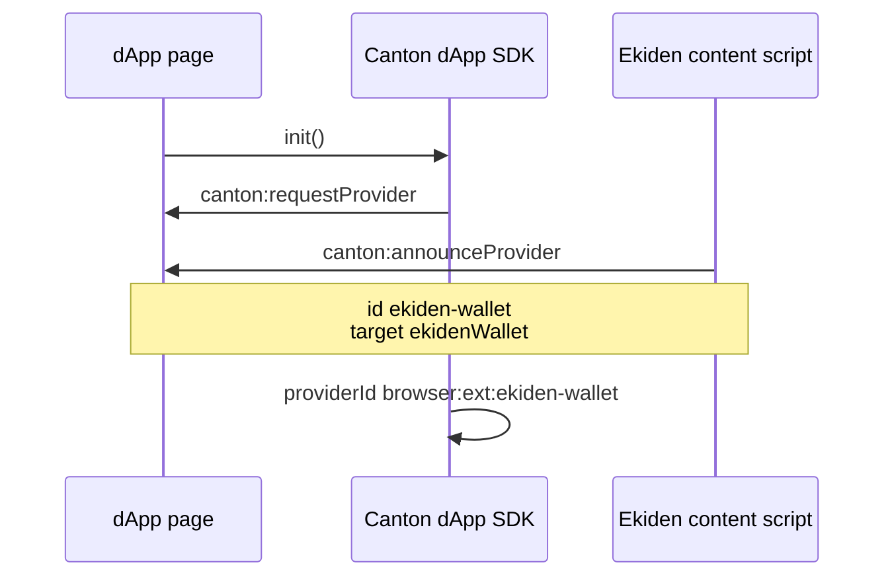

```mermaid
sequenceDiagram
  participant App as dApp page
  participant SDK as Canton dApp SDK
  participant Ext as Ekiden content script

  App->>SDK: init()
  SDK->>App: canton:requestProvider
  Ext->>App: canton:announceProvider
  Note over Ext,App: id ekiden-wallet<br/>target ekidenWallet
  SDK->>SDK: providerId browser:ext:ekiden-wallet
```
