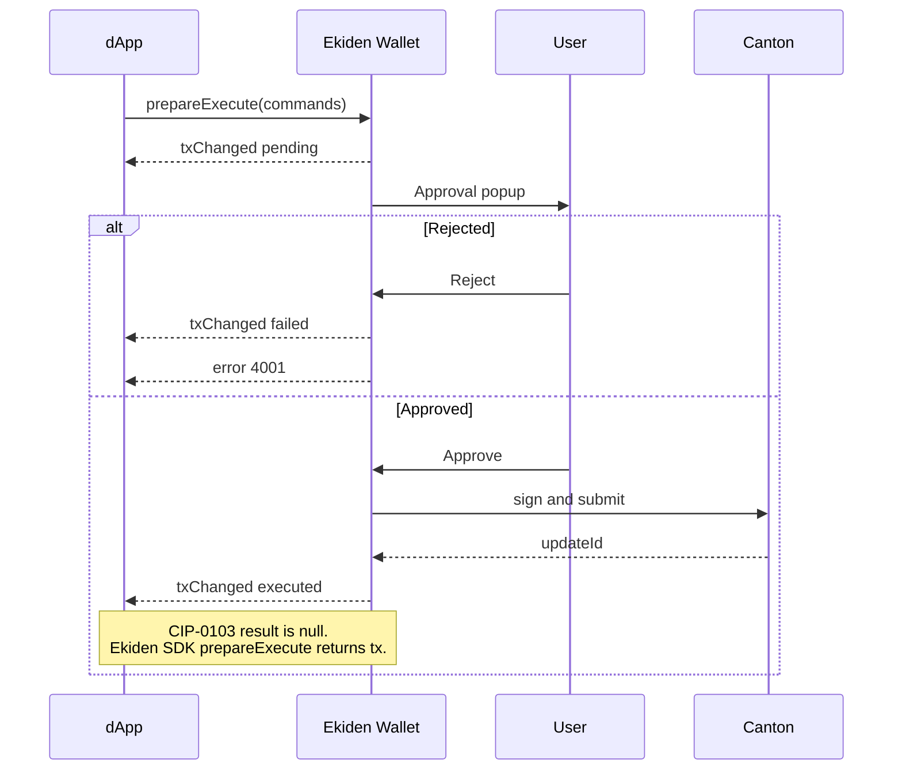

```mermaid
sequenceDiagram
  participant App as dApp
  participant Ext as Ekiden Wallet
  participant User
  participant Ledger as Canton

  App->>Ext: prepareExecute(commands)
  Ext-->>App: txChanged pending
  Ext->>User: Approval popup
  alt Rejected
    User->>Ext: Reject
    Ext-->>App: txChanged failed
    Ext-->>App: error 4001
  else Approved
    User->>Ext: Approve
    Ext->>Ledger: sign and submit
    Ledger-->>Ext: updateId
    Ext-->>App: txChanged executed
    Note over App,Ext: CIP-0103 result is null.<br/>Ekiden SDK prepareExecute returns tx.
  end
```
