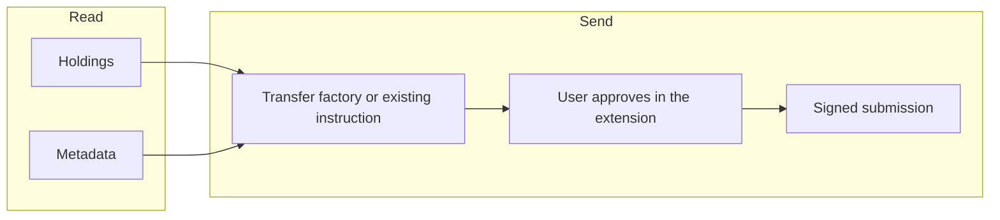

CIP-0056 instruments the wallet knows how to move. The dApp is not on this path when the user sends from the extension UI.

Canton Coin uses the Holding interface and the transfer-factory choice. Utility instruments use the utility holding and transfer-offer / transfer-instruction contracts. Allocation for delivery-versus-payment is not this chart.
